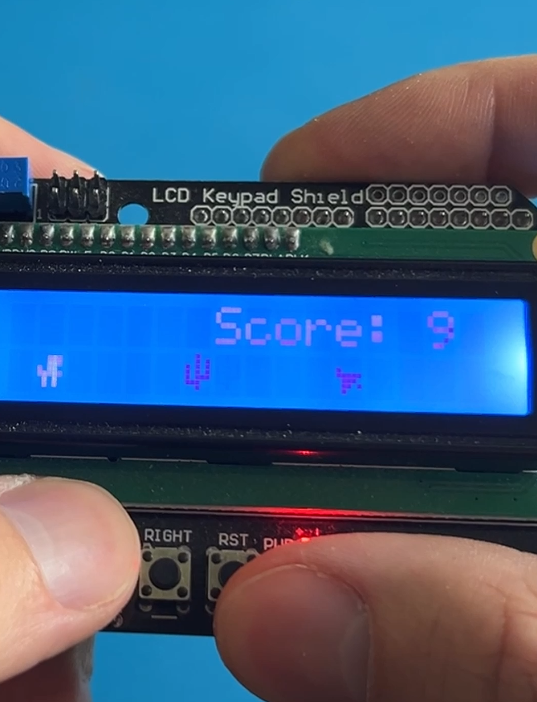

# Arduino Dino Game for LCD Keypad Shield

A faithful recreation of the popular Chrome Dino game, designed to run on an Arduino Uno with an LCD Keypad Shield. Jump over obstacles, beat your high score, and enjoy retro gaming on a 16x2 LCD display!

## Features

- **Classic Gameplay**: Recreation of the Chrome Dino jumping game
- **Custom Pixel Art**: Hand-crafted 8-bit character sprites for dino, cacti, and birds
- **Dynamic Obstacles**: Randomized cactus and bird obstacles with intelligent spacing
- **Score System**: Real-time scoring with persistent high score storage in EEPROM
- **Smooth Animation**: Optimized refresh rates for fluid gameplay experience
- **LED Indicator**: Built-in LED blinks to show game is running
- **Easy Controls**: Simple one-button jump control using the UP button
- **Intuitive UI**: Splash screen, game over screen, and score display

## Hardware Requirements

- **Arduino Uno** (or compatible)
- **LCD Keypad Shield** (16x2 LCD with 5 buttons)
- Standard USB cable for programming

### Pin Configuration
The LCD Keypad Shield uses the following pins:
- LCD: Pins 4, 5, 6, 7, 8, 9
- Buttons: Analog pin A0
- LED: Pin 13 (built-in)

## Installation

1. **Clone or Download** this repository to your local machine
2. **Open** `DinoGameOnShield.ino` in the Arduino IDE
3. **Ensure** all three files are in the same folder:
   - `DinoGameOnShield.ino` (main file)
   - `Functions.ino` (game functions)
   - `bitmaps.h` (custom character definitions)
4. **Select** your Arduino board and port in the IDE
5. **Upload** the code to your Arduino

## How to Play

1. **Power on** your Arduino with the LCD Keypad Shield attached
2. **Press SELECT** on the splash screen to start the game
3. **Press UP** to make the dino jump over obstacles
4. **Avoid** hitting cacti and birds to keep your score climbing
5. **Game Over** occurs when you hit an obstacle
6. **High scores** are automatically saved and displayed

## Screenshots

## Customization

The game includes several adjustable parameters in the main code:

- `chance_of_ob`: Controls obstacle frequency (lower = more obstacles)
- `speedOfScroller`: Game speed in milliseconds
- `jumpLength`: Duration of jump in milliseconds
- `obstacleSpacing`: Minimum spacing between obstacles

## Code Structure

- **DinoGameOnShield.ino**: Main game loop and setup
- **Functions.ino**: Game logic, display functions, and EEPROM handling  
- **bitmaps.h**: Custom character bitmap definitions for LCD

## Technical Details

- **Memory Efficient**: Optimized for Arduino Uno's limited RAM
- **Non-blocking Code**: Uses `millis()` for timing to maintain responsiveness
- **EEPROM Storage**: High scores persist through power cycles
- **Collision Detection**: Precise hit detection for fair gameplay

## License

This project is licensed under the MIT License - see the [LICENSE](LICENSE) file for details.

## Credits

**Author**: Terminal Technology Tips  
**YouTube**: [@TerminalTechnologyTips](https://youtube.com/@TerminalTechnologyTips)  
**Date**: July 2025

## Issues & Support

If you encounter any issues or have questions:
1. Check that your LCD Keypad Shield is properly connected
2. Verify all three files are in the same Arduino sketch folder
3. Ensure you're using a compatible LCD Keypad Shield
4. Open an issue in this repository for further assistance

## Contributing

1. Fork the repository
2. Create a feature branch
3. Test on actual hardware
4. Submit pull request

## Future Enhancements

Potential improvements for future versions:
- Variable game speed that increases with score
- Multiple obstacle types and patterns
- Sound effects using a buzzer
- Different difficulty levels
- Animated character sprites

---

**Enjoy the game!**
